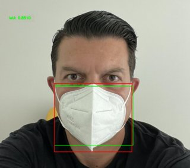

# object-detection-yolov4

A complete guide to object detection using YOLO V4  and OpenCV

</a>

This collection of Google Colab-Notebooks demonstrates how to perform object detection using the YOLO V4 model.

The material is seperated in two sections as listed below:

## object detection using the pretrained model

Access the two notebooks for a step-by-step deployment of the object detector on images and video containing instances of the COCO dataset classes.

- object_detection_yolov4_pretrained_image.ipynb
- object_detection_yolov4_pretrained_video.ipynb

## object detection using a custom-trained model

Access the two notebooks for a step-by-step guide on how to train a custom model tuned to your training data and deploy it on new, previously unseen images. The exercise focuses on face-mask detection and uses the publically available dataset [*Face Mask Detection(Images with YOLO Format)*](https://www.kaggle.com/saurah403/face-mask-detectionimages-with-yolo-format) posted in [kaggle](www.kaggle.com).

- object_detection_yolov4_custom_model_train.ipynb
- object_detection_yolov4_custom_model_deploy.ipynb

## requirements
You need to have a Google account and access to your Google Drive

## license
This material is provided as is and it is meant for educational purposes only. Use it as you wish at your own risk. PLease include a reference to this page.
